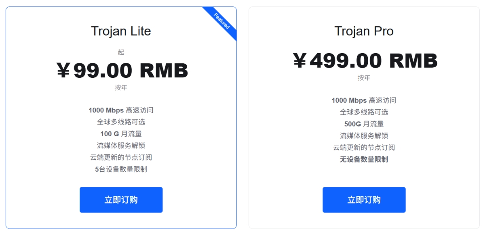

# 一枝红杏机场 2026 最新官网地址(6月更新)

## 一枝红杏机场官网地址

最新官网地址：  
[https://order.yizhihongxing.org/](https://order.yizhihongxing.org/aff.php?aff=22767)

备用官网地址：  
[https://order.yizhihongxing.club/](https://order.yizhihongxing.club/aff.php?aff=22767)

作为运营多年的老牌机场服务商，一枝红杏提供服务已超过 10 年的时间，凭借稳定的线路质量和丰富的节点资源，长期受到不少用户关注。对于有跨地区网络访问、流媒体观看以及日常办公需求的用户来说，其整体表现较为均衡。

---

## 一枝红杏机场核心特点

### 全球优质节点覆盖

一枝红杏主要提供美国、日本、澳大利亚、德国、荷兰、爱沙尼亚、香港、台湾等多个地区的服务器节点，能够为不同地区用户提供较低延迟和稳定的连接体验。无论是浏览网页、观看视频还是远程办公，都能获得较为流畅的网络环境。

### 支持多种主流协议

平台支持以 Trojan 协议为主，兼顾连接速度与数据传输安全性，满足不同设备和使用场景的需求。

### 高速稳定线路

采用优质国际带宽资源，并通过智能调度和负载均衡技术优化线路质量，在高峰时段依然能够保持较好的连接稳定性，适用于高清视频、在线游戏以及大文件传输等场景。

### 注重隐私与安全

平台采用加密传输技术，并宣称执行无日志策略，能够在一定程度上保护用户数据安全和隐私。

### 多平台客户端支持

支持 Windows、macOS、Android、iOS 等主流操作系统，用户可快速完成配置并同步多个设备使用，降低上手门槛。

### 良好的性价比

相比同类型机场产品，一枝红杏的入门套餐价格较低，同时提供较大的流量额度，适合不同预算和需求的用户选择。

---

## 一枝红杏机场套餐价格

目前主要提供 Trojan Lite 与 Trojan Pro 两种订阅方案：

| 套餐 | 年付价格 | 月流量 | 峰值带宽 | 设备数量 | 流媒体解锁 |
|------|----------|---------|----------|----------|------------|
| Trojan Lite | ¥99/年 | 100GB | 1000Mbps | 5台设备 | 支持 |
| Trojan Pro | ¥499/年 | 500GB | 1000Mbps | 不限设备 | 支持 |

---

## 套餐分析

### Trojan Lite

**价格：99元/年**

这是目前一枝红杏最具性价比的入门套餐之一。

**优势：**

- 年费门槛低；
- 每月100GB流量满足日常使用；
- 可同时连接5台设备。

**适合人群：**

- 轻度用户；
- 学生群体；
- 日常浏览与视频观看用户；

---

### Trojan Pro

**价格：499元/年**

面向流量需求较大的用户群体。

**优势：**

- 每月500GB大流量；
- 设备数量不限；
- 更适合长期高频率使用；
- 适合多人共享或团队使用。

**适合人群：**

- 重度网络用户；
- 远程办公群体；
- 流媒体爱好者；
- 多设备家庭及团队用户。

---

## 支付方式

一枝红杏支持多种支付渠道，包括：

- 支付宝
- 微信支付
- 信用卡
- 加密货币支付

用户可根据自身需求选择对应方式完成订阅。

---

## 总体评价

从整体配置来看，一枝红杏机场属于运营时间较长、线路资源较成熟的机场服务之一。其优势主要体现在节点覆盖广、连接稳定、多协议支持以及较高的性价比。

其中，Trojan Lite 套餐以较低的价格提供了不错的流量额度，非常适合个人用户；而 Trojan Pro 则能够满足高流量、多设备以及团队协作场景的需求。

如果你正在寻找一款兼顾稳定性、速度和价格表现的机场服务，一枝红杏仍然是值得关注的选择之一。

## 官网入口

**最新地址：**  [https://order.yizhihongxing.org/](https://order.yizhihongxing.org/aff.php?aff=22767)
